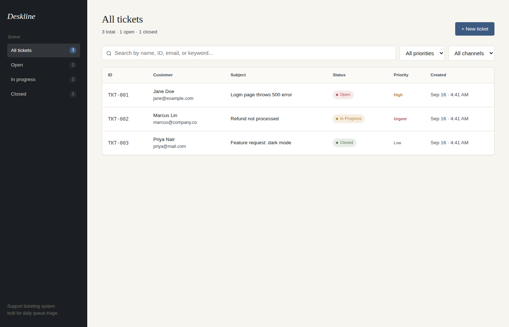
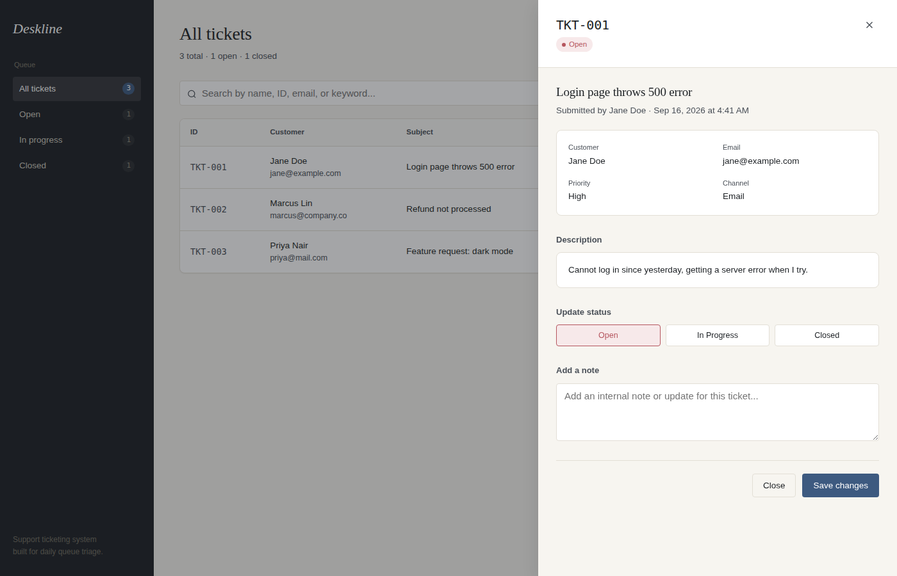
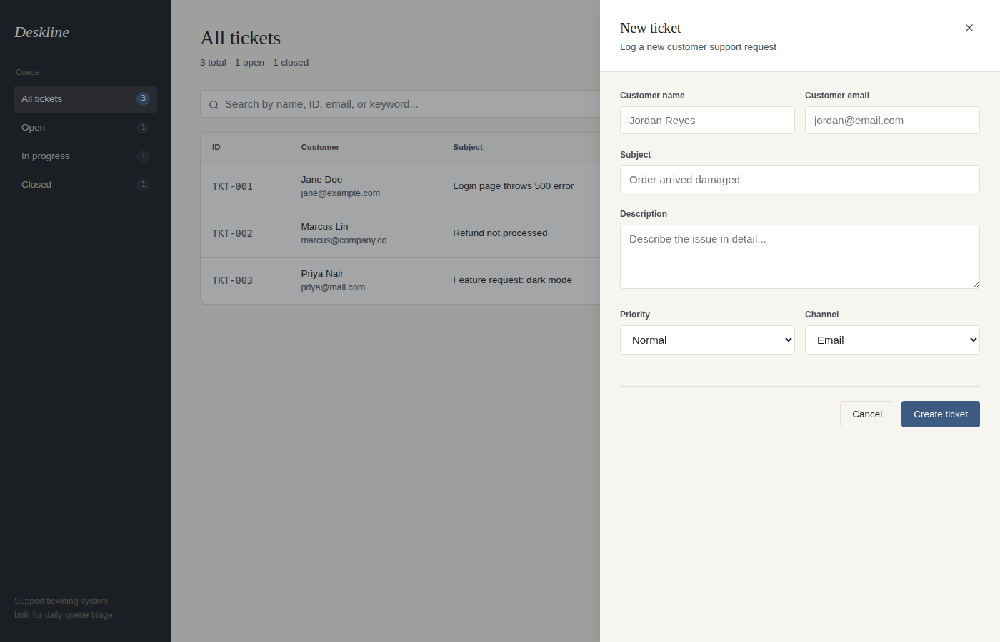

# Deskline — Support Ticketing CRM

A full-stack customer support ticketing system: create tickets, search and filter the queue, and update ticket status with internal notes — built for a small support team handling requests across multiple channels.

---

## Screenshots

**Ticket queue** — sidebar with live status counts, search-as-you-type, and priority/channel filters.


**Ticket detail** — full ticket info, one-click status updates, and a note history.


**New ticket form** — create a ticket with customer info, priority, and channel.


---

## Tech stack

| Layer | Choice |
|---|---|
| Frontend | React (Vite) |
| Backend | Node.js + Express |
| Database | SQLite (via `better-sqlite3`) |
| Deployment | Render (single service, API serves the built frontend) |

I picked this stack because SQLite needs zero setup (no external DB service to provision, no connection strings to manage) which keeps the deploy simple, while `better-sqlite3` is synchronous and fast enough that the API code stays simple and readable — no async/await ceremony around every query.

## Features

- **Create tickets** — customer name, email, subject, description, priority, and channel. Ticket IDs auto-generate sequentially (`TKT-001`, `TKT-002`, ...).
- **Ticket queue** — clean table view with ID, customer, subject, status, priority, and created date.
- **Search-as-you-type** — debounced search across name, email, ticket ID, subject, and description.
- **Filter by status, priority, and channel** — combinable filters, plus a sidebar queue view (All / Open / In Progress / Closed) with live counts.
- **Ticket detail & update** — view full ticket details, change status, and append internal notes (with a timestamped note history).

### Extra: priority + channel tracking

Beyond the core spec, tickets carry a **priority** (Low/Normal/High/Urgent) and a **channel** (Email/Chat/Phone/Social). The brief asks what a real team handling hundreds of tickets across multiple channels would actually need — and the honest answer is: some way to triage what's urgent and know where it came from. Both fields are simple enums with sensible defaults, so they add real triage value without touching the two-table schema the brief asks to keep simple. The tradeoff: no due-date/SLA logic sits on top of priority yet — it's a signal for a human to act on, not automation.

## Database schema

Two tables, as specified:

```sql
tickets (
  id INTEGER PRIMARY KEY,
  ticket_id TEXT UNIQUE,      -- e.g. TKT-001
  customer_name TEXT,
  customer_email TEXT,
  subject TEXT,
  description TEXT,
  status TEXT,                -- Open | In Progress | Closed
  priority TEXT,               -- Low | Normal | High | Urgent
  channel TEXT,                 -- Email | Chat | Phone | Social
  created_at TEXT,
  updated_at TEXT
)

notes (
  id INTEGER PRIMARY KEY,
  ticket_id TEXT REFERENCES tickets(ticket_id),
  note_text TEXT,
  created_at TEXT
)
```

## API endpoints

| Method | Endpoint | Description |
|---|---|---|
| `POST` | `/api/tickets` | Create a ticket. Body: `{ customer_name, customer_email, subject, description, priority?, channel? }` |
| `GET` | `/api/tickets` | List tickets. Query params: `status`, `search`, `priority`, `channel` |
| `GET` | `/api/tickets/:ticket_id` | Get a single ticket with its notes |
| `PUT` | `/api/tickets/:ticket_id` | Update status/priority and optionally add a note. Body: `{ status?, priority?, notes? }` |
| `GET` | `/api/tickets/stats` | Ticket counts by status, for the dashboard header |

All endpoints validate input and return `400`/`404` with a JSON `{ error }` message on failure.

## Project structure

```
support-crm/
├── server/           # Express API + SQLite
│   ├── index.js      # Routes
│   ├── db.js         # DB connection + schema
│   ├── utils.js       # Ticket ID generation, validation
│   └── .env.example
├── client/            # React (Vite) frontend
│   ├── src/
│   │   ├── components/
│   │   ├── App.jsx
│   │   ├── api.js
│   │   └── styles.css
│   └── .env.example
└── README.md
```

## Running locally

Requires Node.js 18+.

**1. Clone and install:**
```bash
git clone <your-repo-url>
cd support-crm

cd server && npm install
cd ../client && npm install
```

**2. Set up environment files:**
```bash
cd server && cp .env.example .env
cd ../client && cp .env.example .env
```

**3. Run in development (two terminals):**
```bash
# Terminal 1 — API on port 4000
cd server && npm run dev

# Terminal 2 — frontend on port 5173, proxies /api to the server
cd client && npm run dev
```

Visit `http://localhost:5173`.

**4. Or run a production build locally:**
```bash
cd client && npm run build
cd ../server && npm start
```
This serves the built frontend directly from the Express server at `http://localhost:4000`.

## Deployment

Deployed as a single Render Web Service: the Express server serves both the API and the built React frontend, so there's only one service, one URL, and no CORS setup needed in production.

Build command:
```bash
cd client && npm install && npm run build && cd ../server && npm install
```

Start command:
```bash
cd server && npm start
```

See the full step-by-step deployment guide provided separately, or the comments in `server/index.js` for how static file serving is wired up.

## What I'd improve with more time

- Pagination on the ticket list (fine at hundreds of tickets, would need it at thousands)
- Basic auth for the agent-facing dashboard
- Per-ticket SLA timers driven off the priority field
- Optimistic UI updates instead of full refetch after create/update
